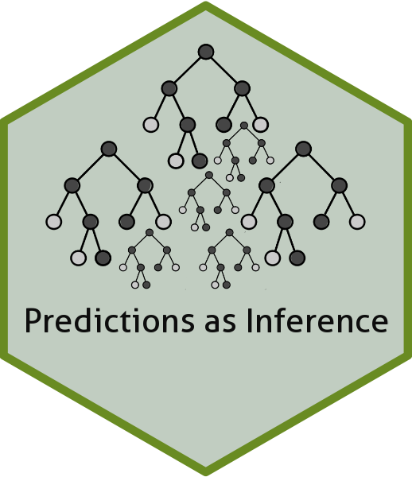

# README: Predictions as Inference (R)

<div style="text-align: center;">
  
</div>
<hr style="margin-top: 10px; margin-bottom: 10px;">
     
## Description
This is a package designed for use in ```R``` that allows for the implementation of ``` Predictions as Inference (PAI) ``` from Johnson, Strother, and Truscott (Working Paper), as well as additional diagnostic tools. Navigate to ``` Documentation ``` for walkthroughs and other relevant package documentation.


## *Notice* 
This package is currently in development (as of March 2024). For early access, use:

```
remotes::install_github("JakeTruscott/predictions-as-inference")
```

## About Package Developer
  
Jake S. Truscott, Ph.D  
[](https://twitter.com/JakeTruscott_44) <br> C-Span Center for Scholarship and Engagement, Purdue University (West Lafayette, IN) <br>
University of Florida, Department of Political Science (Beginning Fall 2024)

